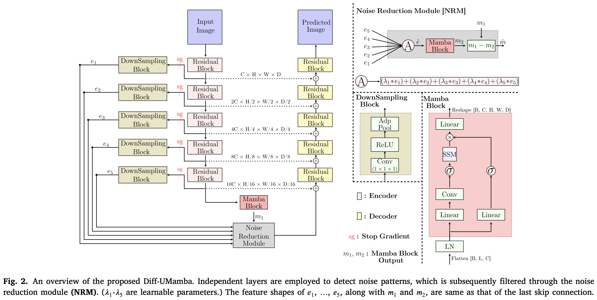
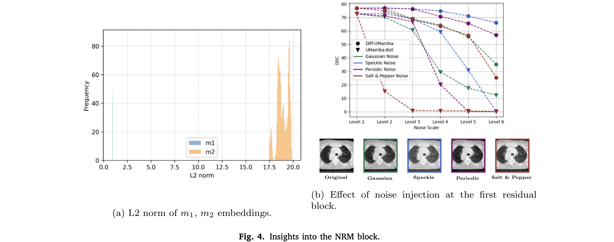
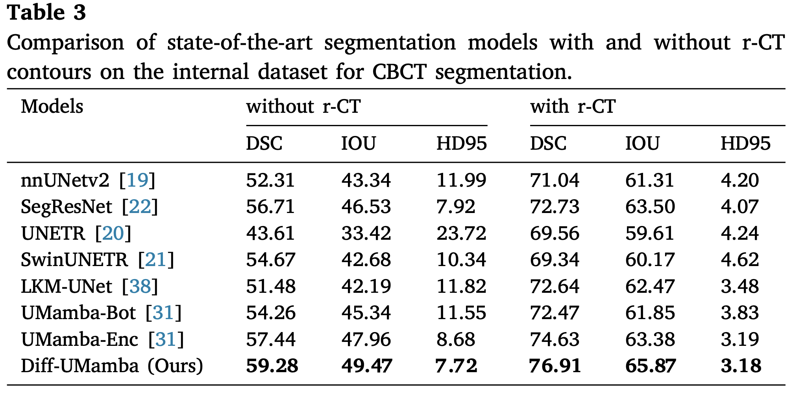
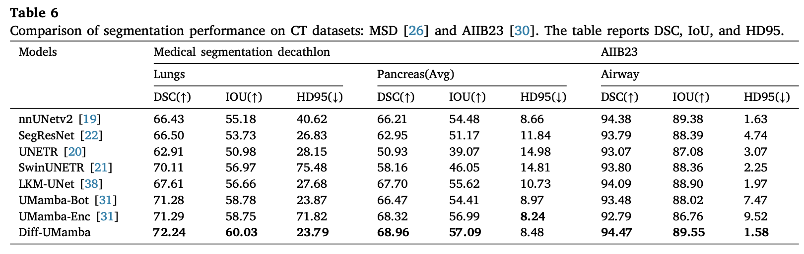
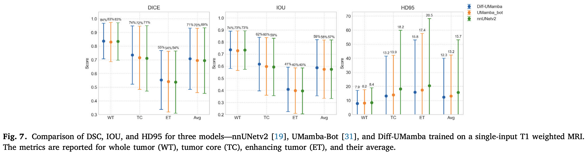
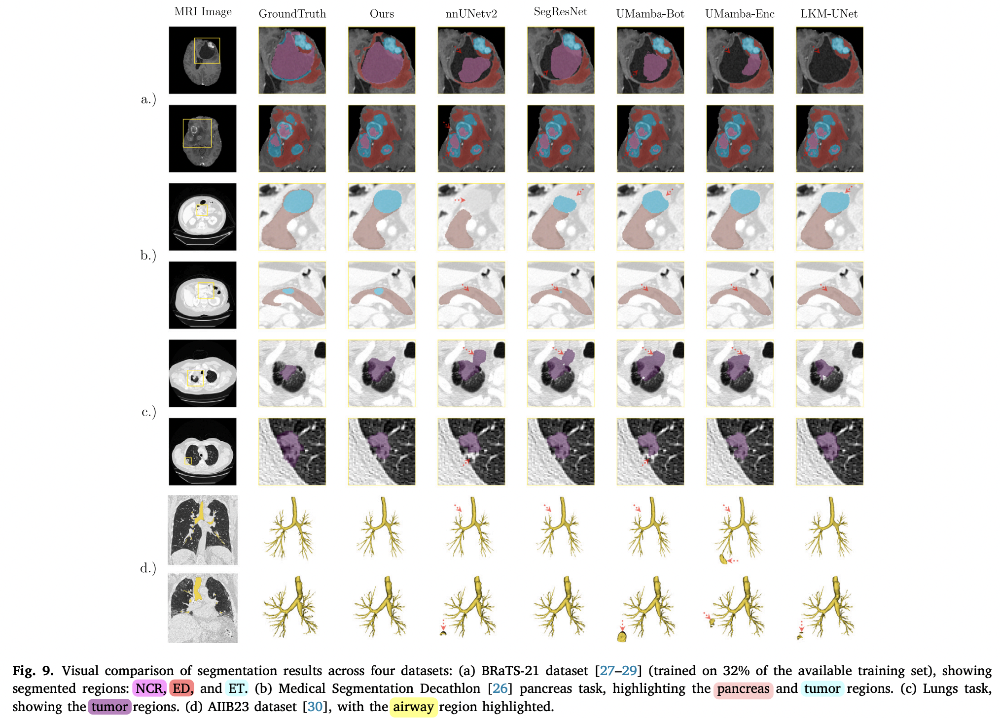

#  Differential UMamba: Rethinking tumor segmentation under limited data scenarios

This is the official repository of Differential UMamba. It is accepted at Biomedical Signal Processing and Control. The paper is available  [here](https://www.sciencedirect.com/science/article/pii/S1746809426007172). 


* This repository is based on [UMamba_Bot](https://github.com/bowang-lab/U-Mamba).
* The code is written based on the [nnUNet](https://github.com/MIC-DKFZ/nnUNet) framework.
* To train this network on your custom dataset, refer to [training](training.md).

## Model Description



- DiffUMamba targets the overfitting spurious noise learnt due to limited data setting. 
- Noise Reduction Module (NRM) is proposed to remove the common-mode noise from each of the encoder layers. 
- Inspired by the [Differential Transformer](https://openreview.net/forum?id=OvoCm1gGhN).
- DiffUMamba works well for ($<500$ volumes).

## NRM Importance


a. It illustrates the
L2 norm of m1 and m2 in 1,280 patches from test set processed
by the Diff-UMamba encoder. 

b. Diff-UMamba adapts more effectively than UMamba-Bot to noise injection. 

## Results 


 




## Visual Comparison



## Citation

If you find this code useful for your research, please consider citing:

``` 
@article{jain2026differential_umamba,
  title   = {Differential-UMamba: Rethinking tumor segmentation under limited data scenarios},
  author  = {Jain, Dhruv and Modzelewski, Romain and Hérault, Romain and Chatelain, Clement and Torfeh, Eva and Thureau, Sebastien},
  journal = {Biomedical Signal Processing and Control},
  volume  = {120},
  pages   = {110163},
  year    = {2026},
  issn    = {1746-8094},
  doi     = {10.1016/j.bspc.2026.110163},
  url     = {https://doi.org/10.1016/j.bspc.2026.110163}
}
```


## Acknowledgements

This work was supported by the MINMACS Région Normandie
excellence label and ANR LabCom L-Lisa ANR-20-LCV1-0009. We thank our colleagues at CRIANN for providing us with the computational resources necessary for
this project. 